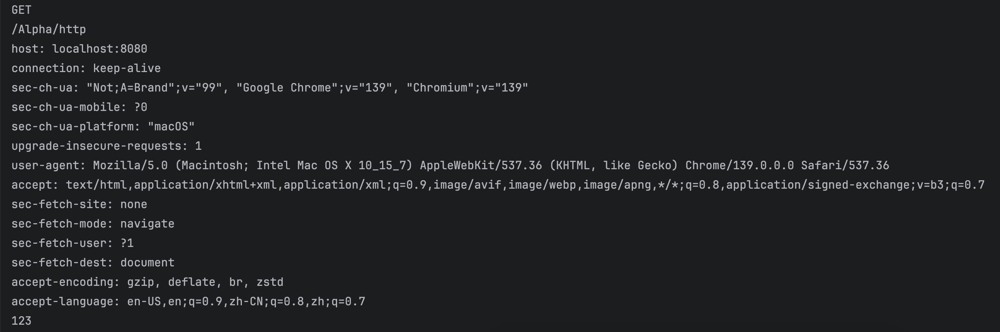

# Spring MVC Fundamentals — 2025-08-08

This log documents a series of exercises in Spring MVC, covering:
1. Inspecting HTTP requests and sending responses
2. GET requests with query parameters and path variables
3. Handling POST form submissions
4. Returning HTML views with Thymeleaf (via `ModelAndView` and `Model`)
5. Returning JSON for asynchronous requests (AJAX)
6. Returning JSON arrays for multiple records

---

## 1) Inspecting HTTP Requests/Responses

**Goal:** Build a controller method to print incoming HTTP request info (method, path, headers, query parameters) and return a basic HTML response.

### Controller Method
``` java
    @RequestMapping("/http")
    public void http(HttpServletRequest request, HttpServletResponse response){
        // === Retrieve and print request data ===

        // Print HTTP request method (e.g., GET, POST)
        System.out.println(request.getMethod());
        // Print the servlet path (URI mapping after the context path)
        System.out.println(request.getServletPath());
        // Iterate over all request headers and print their names and values
        Enumeration<String> enumeration = request.getHeaderNames();
        while(enumeration.hasMoreElements()){
            String name = enumeration.nextElement();
            String value = request.getHeader(name);
            System.out.println(name + ": " + value);
        }
        // Print the value of the "code" request parameter (e.g., ?code=123)
        System.out.println(request.getParameter("code"));

        // === Send response back to client ===

        // Set the response content type and character encoding
        response.setContentType("text/html;charset=utf-8");
        // Write HTML content to the response
        try(PrintWriter writer = response.getWriter();){
            writer.write("<h1>community</h1>");
        }catch (IOException e){
            e.printStackTrace();
        }
    }
```
Test in Browser  
Accessed: `http://localhost:8080/community/alpha/http?code=123`
### Output Screenshot



---

## 2) GET Request with Query Parameters

**Goal:** Create an endpoint `/students` that accepts two optional query parameters:
- `current`: The page number (default = 1)
- `limit`: The maximum number of records per page (default = 10)

---

### Controller Method

```java
    // Handle GET requests to retrieve student data
// Example request: /students?current=1&limit=20
// Retrieves student data for page 1, with up to 20 records per page.
@RequestMapping(path = "/students", method = RequestMethod.GET)
@ResponseBody
public String getStudents(
        @RequestParam(name = "current", required = false, defaultValue = "1") int current,
        @RequestParam(name = "limit", required = false, defaultValue = "10") int limit){
    // Print the received values to the console 
    System.out.println(current);
    System.out.println(limit);
    // Return a simple text response to the client
    return "some students";
}
```
Accessed: `http://localhost:8080/community/alpha/students?current=3&limit=20`
Console Output  
The console log showed the values of current and limit:
```
3 
20
```
---

## 3) GET Request with Path Variable

**Goal:** Create an endpoint `/student/{id}` to retrieve details for a specific student based on their ID.

---

### Controller Method

```java
// Handle GET requests for a single student by ID
// Example: /student/123 -> Retrieves the student with ID 123
@RequestMapping(path = "/student/{id}", method = RequestMethod.GET)
@ResponseBody
public String getStudent(
        // Extract the "id" value from the URL path and bind it to the 'id' parameter
        @PathVariable("id") int id) {
    
    // Print the extracted ID to the console (for debugging/demo purposes)
    System.out.println(id);

    // Return a simple text response to the client
    return "a student";
}
```
Accessed: `http://localhost:8080/community/alpha/student/123`  
The browser displayed: `a student`  
Console Output  
The console log showed the extracted student ID: `123`  
---

## 4) POST Request — Submitting a Student Form

**Goal:** Create an HTML form for adding a student, send the data via POST to `/student`, and handle the request in the controller.

---

### HTML Form (`src/resources/static/html/student.html`)

```html
<!DOCTYPE html>
<html lang="en">
<head>
    <meta charset="UTF-8">
    <title>Add a student</title>
</head>
<body>
    <form method="post" action="/community/alpha/student">
        <p>
            name: <input type="text" name="name">
        </p>
        <p>
            age: <input type="text" name="age">
        </p>
        <p>
            <input type="submit" value="save">
        </p>
    </form>
</body>
</html>
```
Controller Method  
```
// Handle POST requests to save a student
@RequestMapping(path = "/student", method = RequestMethod.POST)
@ResponseBody
public String saveStudent(String name, int age) {
    // Print form-submitted values to the console
    System.out.println(name);
    System.out.println(age);

    // Return a simple success message
    return "success";
}
```
Test in Browser: `http://localhost:8080/community/html/student.html`   
Filled out:  
 - name: Hao She
 - age: 15

Clicked 'save' -> Browser displayed: `success`  
Console Output  
The console log showed the submitted values:
```
Hao She
15
```
---

## 5) Returning an HTML View with Thymeleaf (ModelAndView)

**Goal:** Return a Thymeleaf-rendered HTML view with teacher data.

---

### Controller Method

```java
// Handle GET requests and return an HTML view response
@RequestMapping(path = "/teacher", method = RequestMethod.GET)
public ModelAndView getTeacher() {
    // Create a ModelAndView object to hold both model data and view name
    ModelAndView mav = new ModelAndView();

    // Add model attributes (key-value pairs) to be passed to the view
    mav.addObject("name", "Hao She");
    mav.addObject("age", 30);

    // The template file is located in src/main/resources/templates/demo/view.html
    // In setViewName, omit the .html extension — just use the path within the templates folder
    mav.setViewName("/demo/view");

    // Return the ModelAndView, which will be rendered by the view resolver
    return mav;
}
```
Thymeleaf Template (`src/main/resources/templates/demo/view.html`)
``` html
<!DOCTYPE html>
<!-- 
This HTML file is a Thymeleaf template.
`xmlns:th="http://www.thymeleaf.org"` declares the Thymeleaf XML namespace,
allowing the use of `th:*` attributes as defined in the Thymeleaf syntax.
The syntax and usage are based on the Thymeleaf official documentation.
-->
<html lang="en" xmlns:th="http://www.thymeleaf.org">
<head>
    <meta charset="UTF-8">
    <title>Teacher</title>
</head>
<body>
    <!-- Display the value of the "name" attribute from the model -->
    <p th:text="${name}"></p>

    <!-- Display the value of the "age" attribute from the model -->
    <p th:text="${age}"></p>
</body>
</html>
```
Test in Browser  
Accessed: `http://localhost:8080/community/alpha/teacher`  
Browser displayed:  
```
Hao She
30
```
Notes/Takeaways  
- ModelAndView combines both data (model) and view name in one object.
- Thymeleaf templates are stored in src/main/resources/templates/.
- No need to include .html when specifying the view name in setViewName().
- ${...} syntax is used in Thymeleaf to reference variables passed from the controller.

---

## 6) Returning an HTML View Using `Model`

**Goal:** Create a `/school` endpoint that returns the same Thymeleaf template as `/teacher`, but uses the `Model` parameter instead of `ModelAndView`.

---

### Controller Method

```java
// Handle GET requests and return an HTML view
@RequestMapping(path = "/school", method = RequestMethod.GET)
public String getSchool(Model model) {
    // Add model attributes (key-value pairs) to be passed to the view
    model.addAttribute("name", "Trinity College Dublin");
    model.addAttribute("age", 433);

    // Return the logical view name (template path without the .html extension)
    // The template is located at src/main/resources/templates/demo/view.html
    return "/demo/view";
}
```
Test in Browser  
Accessed: `http://localhost:8080/community/alpha/school`  
Browser displayed:
```
Trinity College Dublin
433
```
### Notes / Takeaways

- This approach uses the `Model` interface to pass data to the view and returns the view name as a `String`.
- The view name refers to a Thymeleaf template under `src/main/resources/templates/`, with no `.html` extension.
- **Difference from `/teacher` example**:
    - `/teacher` used `ModelAndView` to set both the model and view name in a single object.
    - `/school` uses `Model` for the data and the return value for the view name, which is more concise for simple cases.
    - Both methods produce the same final HTML output.


---

## 7) Returning JSON for Asynchronous Requests (AJAX)

**Goal:** Create an endpoint `/emp` that returns JSON data, suitable for asynchronous requests such as AJAX calls from the frontend.

---

### Controller Method

```java
/*
Asynchronous request example:
Imagine you’re on an online shopping site. You type “headphones” into the search box, and as you type,
the site shows live suggestions (“headphones wireless,” “headphones noise-cancelling,” etc.) without refreshing the whole page.

Behind the scenes:
- Each keystroke triggers an asynchronous request to the server.
- The page keeps running, you can continue typing.
- Search suggestions appear immediately when the server responds.

This is AJAX (Asynchronous JavaScript and XML) in action.
*/

// Handle GET requests and respond with JSON data (for asynchronous requests)
// Flow: Java object -> JSON string -> JavaScript object
@RequestMapping(path = "/emp", method = RequestMethod.GET)
@ResponseBody
public Map<String, Object> getEmp() {
    // Create a map to hold employee data
    Map<String, Object> emp = new HashMap<>();
    
    // Populate employee data
    emp.put("name", "Hao She");
    emp.put("age", 23);
    emp.put("salary", 8000.00);
    
    // Return the map — Spring MVC will automatically convert it to JSON
    return emp;
}
```
Test in Browser  
Accessed: `http://localhost:8080/community/alpha/emp`  
Browser displayed (formatted for clarity):
```
{
    "name": "Hao She",
    "age": 23,
    "salary": 8000.0
}
```
### Notes / Takeaways

- `@ResponseBody` instructs Spring to write the return value directly into the HTTP response body, bypassing view resolution.
- Spring automatically converts Java objects (e.g., `Map`) into JSON if a JSON converter (such as Jackson) is available on the classpath.
- AJAX requests often expect JSON so that only parts of a webpage can be updated without a full page reload.
- Data flow: **Java object → JSON string → JavaScript object** in the browser.

---

## 8) Returning a JSON Array of Multiple Employees

**Goal:** Create an endpoint `/emps` that returns a list of employees in JSON format.

---

### Controller Method

```java
// Handle GET requests and return a list of employees in JSON format
@RequestMapping(path = "/emps", method = RequestMethod.GET)
@ResponseBody
public List<Map<String, Object>> getEmps() {
    // Create a list to hold multiple employees
    List<Map<String, Object>> list = new ArrayList<>();

    // First employee
    Map<String, Object> emp = new HashMap<>();
    emp.put("name", "Hao She");
    emp.put("age", 23);
    emp.put("salary", 8000.00);
    list.add(emp);

    // Second employee
    emp = new HashMap<>();
    emp.put("name", "Brad Pitt");
    emp.put("age", 26);
    emp.put("salary", 10000.00);
    list.add(emp);

    // Third employee
    emp = new HashMap<>();
    emp.put("name", "Niko Kidman");
    emp.put("age", 18);
    emp.put("salary", 20000.00);
    list.add(emp);

    // Return the list — Spring will convert it to a JSON array
    return list;
}
```
Test in Browser  
Accessed: `http://localhost:8080/community/alpha/emps`  
Browser displayed (formatted for clarity):  
```
[
    {
        "name": "Hao She",
        "age": 23,
        "salary": 8000.0
    },
    {
        "name": "Brad Pitt",
        "age": 26,
        "salary": 10000.0
    },
    {
        "name": "Niko Kidman",
        "age": 18,
        "salary": 20000.0
    }
]
```
### Notes / Takeaways

- `List<Map<String, Object>>` enables returning a JSON array where each element is a JSON object containing key–value pairs.
- Spring automatically serializes Java collections and maps to JSON when a converter such as Jackson is available on the classpath.
- This structure is useful for sending multiple records to the frontend in a single response.

## Key Takeaways

- Use `HttpServletRequest` for low-level request inspection.
- `@RequestParam` binds query parameters; `@PathVariable` binds URL segments.
- Static HTML forms can POST directly to controller endpoints.
- `ModelAndView` vs `Model`: choose based on preference and complexity.
- `@ResponseBody` returns JSON directly; Spring handles conversion if Jackson is available.
- Collections of maps can be returned as JSON arrays for multiple records.


